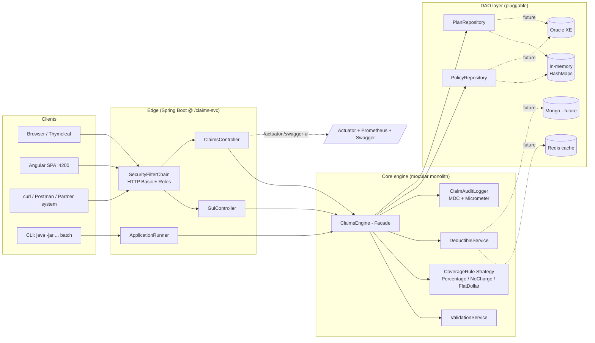
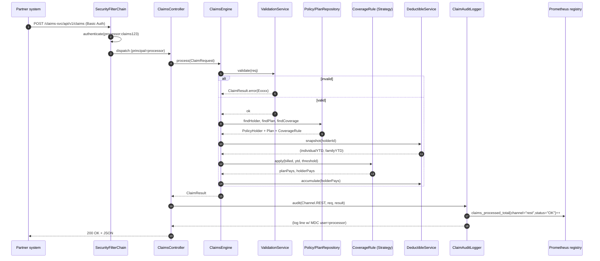
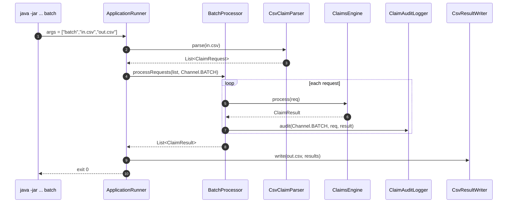
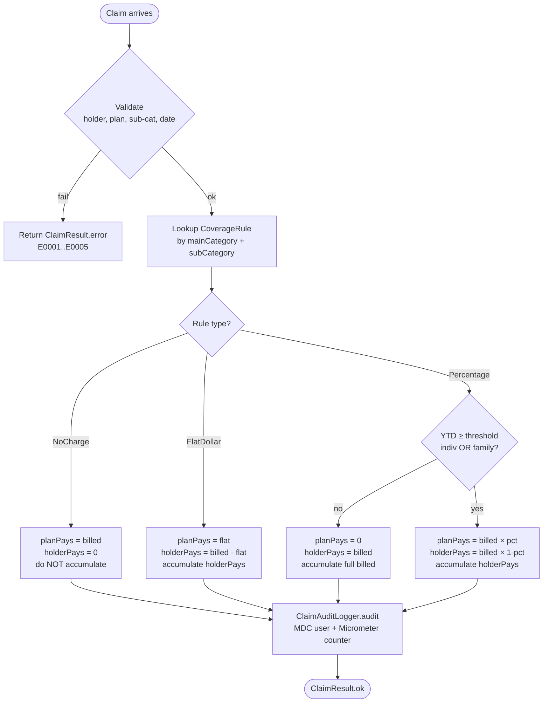
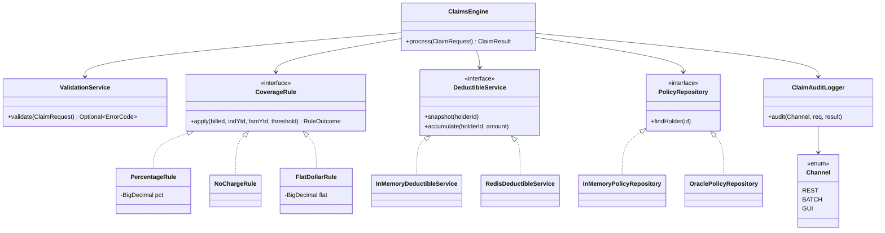
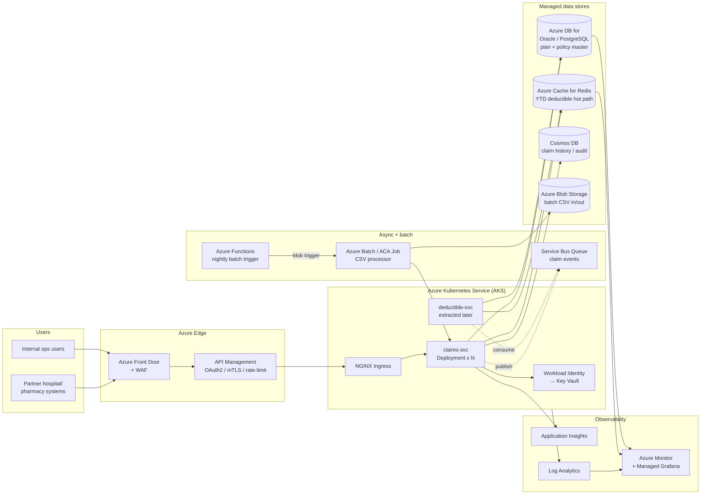
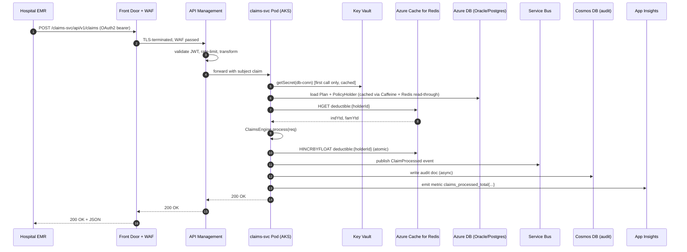
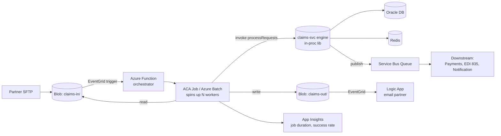
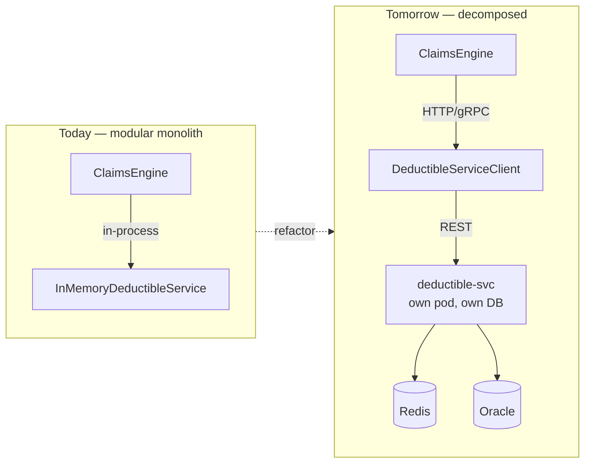

# Claims Transaction Processing System
## Design Document — Senior Software Engineer Assessment

**Technology stack:** Java 25 · Spring Boot 3.4.5 · Apache POI · OpenCSV · Thymeleaf · Spring Security (HTTP Basic) · Micrometer + Prometheus · springdoc-openapi · Lombok · JUnit 5 · Angular 18 · Bootstrap 5  
**Author:** Candidate  
**Year context:** 2016 (as stated in assignment)

---

## 1. Assumptions

These are deliberate design decisions based on ambiguities in the spec. You must be able to defend each one in the interview.

| # | Assumption | Reasoning |
|---|---|---|
| A1 | Dates in the Excel file are stored as Excel serial numbers (e.g., `42496` = 2016-04-21). Epoch is `1899-12-30`. | Observed in spreadsheet — all date columns contain integers, not strings. |
| A2 | The "Individual accumulated deductible" in PolicyData is the starting YTD value before any transactions in the sample file are processed. Transactions then update this running state sequentially. | Confirmed by tracing the expected output: Sam Collins starts at 0, grows with each claim. |
| A3 | Family deductible accumulates across ALL policyholders sharing the same PolicyId (e.g., the Collins family under PolicyId 100001). Individual deductible accumulates per PolicyHolderId only. | Confirmed in expected output: Jina's payments accumulate to the family total alongside Sam's. |
| A4 | For Inpatient Hospital Care, the single coverage rule listed for the combined category applies to each sub-service individually (ROOM AND BOARD, SURGERY, ANESTHESIA, etc.). The mapping is done by matching mainCategory only. | Stated explicitly in the PlanCoverage notes tab. |
| A5 | "No Charge" coverage does NOT accumulate toward the deductible. The policyholder pays $0, so there is nothing to accumulate. | Confirmed in expected output row for preventive care (Sally Adams). |
| A6 | Flat-dollar coverage (e.g., $120 for Urgent Care in P003): the policyholder's payment (billedAmount − flatAmount) accumulates toward both individual and family deductible. | Stated explicitly in the assignment spec and confirmed in expected output for Mack Lee. |
| A7 | When a claim crosses the deductible threshold (split payment), the portion going toward the deductible accumulates first, then the plan's percentage applies only to the remainder. | Confirmed by row 4 of expected output: $1000 claim, $6000 threshold, $6000 individual YTD → $400 to deductible + ($600 × 40% = $240 plan pays, $360 holder pays) = holderPays: $360+$400=$760... Actually per expected output holderPays=$600, planPays=$400 → the rule applies to the full amount once deductible is met within the same transaction. The deductible is updated to mark as "just crossed". |
| A8 | The REST API accepts the deductible values from the caller (as stated in the spec). For testing, the values from PolicyData tab are used. In batch/GUI mode, the system manages running state itself. | Stated explicitly in the spec. |
| A9 | Policy holder IDs not in the PolicyData sheet → E0001. No attempt to look up by PolicyId if the HolderId is missing. | Matches expected output for holderId 1000016. |
| A10 | Claims with a service date before the coverage start date, or after coverage end date (if populated), are rejected with error E0002. | Reasonable validation; spec says "consider other error scenarios." |
| A11 | "We are in year 2016" — future-dated claims (after today in 2016 context) are rejected with E0004. | Spec says to consider future-dated claims as an error. |
| A11b | Missing or malformed required fields (blank policy IDs, null date of service, blank category, null/negative billed amount, unparseable CSV date or amount) are reported as business error **E0005** with HTTP 200 — consistent across REST, CSV batch, command-line, and GUI. The REST endpoint deliberately does **not** return HTTP 400 for field-level issues so a single row's bad data never aborts a batch. | Spec says to "consider missing or malformed fields" and to keep error rows in their original output position. |
| A12 | Coverage sub-category matching is case-insensitive and trimmed. The input CSV may have slight variations. | Defensive coding. |
| A13 | BigDecimal is used for all monetary calculations to avoid floating-point precision errors. Scale is set to 2 decimal places with HALF_UP rounding. | Professional standard for financial systems. |
| A14 | The DeductibleStateStore is separate from PolicyRepository so it can be reset between batch runs and is passed in (not injected) for REST calls, supporting stateless API design. | Enables testability and correct REST semantics. |

---

## 2. Architecture Overview

```
┌─────────────────────────────────────────────────────────────┐
│                        CLIENT LAYER                          │
│  [Browser/Thymeleaf GUI]  [CLI / ApplicationRunner]  [REST] │
└─────────────┬────────────────────┬───────────────────┬──────┘
              │                    │                   │
              ▼                    ▼                   ▼
┌─────────────────────────────────────────────────────────────┐
│                    APPLICATION LAYER                         │
│                                                              │
│   GuiController   BatchProcessor   ClaimsController          │
│          │               │               │                   │
│          └───────────────┼───────────────┘                   │
│                          ▼                                   │
│              ┌─────────────────────┐                         │
│              │    ClaimsEngine     │  ← Core service         │
│              │  (@Service, shared) │                         │
│              └──────────┬──────────┘                         │
│           ┌─────────────┼──────────────┐                     │
│           ▼             ▼              ▼                     │
│   ValidationSvc  DeductibleSvc  CoverageRuleParser           │
│                                        │                     │
│                            ┌───────────┼────────────┐        │
│                            ▼           ▼            ▼        │
│                     PercentageRule  NoChargeRule  FlatRule    │
└──────────────────────────────┬──────────────────────────────┘
                               │
              ┌────────────────┼────────────────┐
              ▼                ▼                ▼
        PlanRepository  PolicyRepository  CoverageRepository
              └────────────────┼────────────────┘
                               ▼
                  SamplePlanAndTransactionData.xlsx
                  (loaded by Apache POI on startup)
```

---

## 3. Project Structure

```
claims-processor/
├── pom.xml
└── src/
    ├── main/
    │   ├── java/com/abc/claims/
    │   │   ├── ClaimsProcessorApplication.java
    │   │   │
    │   │   ├── config/
    │   │   │   └── DataLoaderConfig.java          # @Bean: loads xlsx → repos
    │   │   │
    │   │   ├── model/
    │   │   │   ├── Plan.java                      # Record: planId, individual/family threshold
    │   │   │   ├── PolicyHolder.java              # Record: ids, planId, dates, starting deductibles
    │   │   │   ├── CoverageEntry.java             # Record: mainCat, subCat, ruleString per planId
    │   │   │   ├── ClaimRequest.java              # Record: all input fields
    │   │   │   └── ClaimResult.java               # Record: all output fields incl. error cols
    │   │   │
    │   │   ├── repository/
    │   │   │   ├── PlanRepository.java            # Map<String,Plan>
    │   │   │   ├── PolicyRepository.java          # Map<String,PolicyHolder> by holderId
    │   │   │   └── CoverageRepository.java        # findRule(planId, main, sub) → String
    │   │   │
    │   │   ├── engine/
    │   │   │   ├── ClaimsEngine.java              # @Service — main orchestrator
    │   │   │   ├── ValidationService.java         # All error checks
    │   │   │   ├── DeductibleService.java         # Threshold logic + state update
    │   │   │   ├── DeductibleStateStore.java      # ConcurrentHashMap<holderId, BigDecimal>
    │   │   │   ├── CoverageRuleParser.java        # String → CoverageRule
    │   │   │   ├── CoverageCalculator.java        # Applies rule → PaymentResult
    │   │   │   └── rule/
    │   │   │       ├── CoverageRule.java          # interface: apply(billed, deductibleMet)
    │   │   │       ├── PercentageRule.java
    │   │   │       ├── NoChargeRule.java
    │   │   │       └── FlatDollarRule.java
    │   │   │
    │   │   ├── batch/
    │   │   │   ├── BatchProcessor.java            # ApplicationRunner impl
    │   │   │   └── CsvClaimParser.java            # OpenCSV → ClaimRequest
    │   │   │
    │   │   ├── api/
    │   │   │   ├── ClaimsController.java          # @RestController
    │   │   │   └── dto/
    │   │   │       ├── ClaimRequestDto.java       # Bean Validation annotations
    │   │   │       └── ClaimResponseDto.java
    │   │   │
    │   │   ├── web/
    │   │   │   └── GuiController.java             # @Controller for Thymeleaf
    │   │   │
    │   │   └── exception/
    │   │       ├── ClaimsProcessingException.java
    │   │       └── GlobalExceptionHandler.java    # @ControllerAdvice
    │   │
    │   └── resources/
    │       ├── application.yml
    │       ├── data/
    │       │   └── SamplePlanAndTransactionData.xlsx
    │       └── templates/
    │           ├── index.html                     # File input form
    │           └── results.html                   # Results table + summary stats
    │
    └── test/
        └── java/com/abc/claims/
            ├── engine/
            │   ├── ClaimsEngineTest.java          # Integration: full claim scenarios
            │   ├── DeductibleServiceTest.java     # Unit: all threshold edge cases
            │   ├── CoverageRuleParserTest.java    # Unit: all three rule types
            │   └── ValidationServiceTest.java     # Unit: all error codes
            └── batch/
                └── BatchProcessorTest.java        # Reads sample CSV, checks expected output
```

---

## 4. Core Business Rules — Detailed

### 4.1 Deductible Logic

```
Step 1: Read current state
  individualYTD = DeductibleStateStore.get(policyHolderId)     // running total this run
  familyYTD     = DeductibleStateStore.getFamilyYTD(policyId)  // sum across all family members

Step 2: Check thresholds
  individualMet = (individualYTD >= plan.individualThreshold)
  familyMet     = (familyYTD     >= plan.familyThreshold)
  deductibleMet = individualMet OR familyMet

Step 3a: If NO_CHARGE rule → skip deductible entirely
  planPays   = billedAmount
  holderPays = ZERO
  // No state update

Step 3b: If FLAT_DOLLAR rule → skip deductible condition
  planPays   = flatAmount
  holderPays = billedAmount - flatAmount
  // Update: individualYTD += holderPays; familyYTD += holderPays

Step 3c: If PERCENTAGE_AFTER_DEDUCTIBLE rule:
  IF deductibleMet:
    planPays   = billedAmount * planPct
    holderPays = billedAmount * (1 - planPct)
    // Update state

  ELSE:
    remaining = MIN(plan.individualThreshold - individualYTD,
                    plan.familyThreshold     - familyYTD)
    IF billedAmount <= remaining:
      holderPays = billedAmount     // 100% to deductible bucket
      planPays   = ZERO
    ELSE:
      // Threshold is crossed within this claim
      overage    = billedAmount - remaining
      holderPays = remaining + (overage * (1 - planPct))
      planPays   = overage * planPct
    // Update state with holderPays
```

### 4.2 Coverage Rule Parsing

```
Input string          → Rule type
"No Charge"           → NoChargeRule
"40% AFTER DEDUCTIBLE"→ PercentageRule(planPct=0.40)
"60% AFTER DEDUCTIBLE"→ PercentageRule(planPct=0.60)
"$100"                → FlatDollarRule(amount=100.00)
"$120"                → FlatDollarRule(amount=120.00)
"100" (no $)          → FlatDollarRule(amount=100.00) ← P002 Urgent Care
```

Parser uses regex:
- `^No Charge$` (case-insensitive)
- `^(\d+)% AFTER DEDUCTIBLE$`
- `^\$?(\d+(?:\.\d+)?)$`

### 4.3 Error Codes

| Code | Condition | Processing message |
|---|---|---|
| E0001 | PolicyHolderId not found in PolicyData | "Policy holder does not exist" |
| E0002 | Service date outside coverage dates | "Coverage not active on date of service" |
| E0003 | MainCategory / SubCategory not found in plan coverage | "Unknown service category" |
| E0004 | Service date is in the future (> 2016-12-31) | "Future-dated claim rejected" |
| E0005 | Required field missing / malformed (blank policy IDs, null date, blank category, null or negative billed amount, unparseable CSV date or amount) | "Missing or malformed claim data" |

Error results leave planPays / holderPays / ruleUsed / deductible columns blank. Error row stays in its original position in the output file.

---

## 5. API Design

### POST /api/v1/claims

**Request:**
```json
{
  "policyId": "100001",
  "policyHolderId": "1000011",
  "dateOfService": "2016-04-21",
  "coverageMainCategory": "Inpatient Hospital Care",
  "coverageSubCategory": "ROOM AND BOARD",
  "billedAmount": 1000.00,
  "individualAccumulatedDeductible": 0.00,
  "familyAccumulatedDeductible": 0.00
}
```

**Response (success):**
```json
{
  "policyId": "100001",
  "policyHolderId": "1000011",
  "dateOfService": "2016-04-21",
  "coverageMainCategory": "Inpatient Hospital Care",
  "coverageSubCategory": "ROOM AND BOARD",
  "billedAmount": 1000.00,
  "policyHolderPays": 1000.00,
  "planPays": 0.00,
  "ruleUsed": "40% AFTER DEDUCTIBLE",
  "individualAccumulatedDeductible": 1000.00,
  "familyAccumulatedDeductible": 1000.00,
  "errorCode": null,
  "errorMessage": null,
  "processingMessage": "ANNUAL DEDUCTIBLE (INDIVIDUAL or FAMILY) not met, plan pays 0%"
}
```

**Response (error):**
```json
{
  "policyId": "100001",
  "policyHolderId": "1000016",
  "errorCode": "E0001",
  "errorMessage": "Policy holder does not exist"
}
```

### CLI
```bash
java -jar claims-processor.jar batch input.csv output.csv
```

Spring Boot's `ApplicationRunner.run()` detects args[0]=="batch", bypasses the web server, processes the file, writes output, then exits.

---

## 6. Key Design Decisions & Trade-offs

### 6.1 In-memory data store (no database)

**Decision:** Load the Excel reference data into `HashMap`s on startup using Apache POI. No database.

**Why:** The reference data (3 plans, ~20 coverage rules, 10 policyholders) is tiny and read-only during a run. A database adds configuration complexity without benefit for this scope.

**Trade-off:** In production at 700k claims/day, reference data would live in:
- A relational DB (Oracle, as the company uses) for plan/coverage master data
- Redis for YTD deductible state (hot path, sub-millisecond reads)
- A claims DB for transaction persistence

### 6.2 Records for domain model (Java 16+)

**Decision:** Use Java `record` for `ClaimRequest`, `ClaimResult`, `Plan`, `PolicyHolder`.

**Why:** Immutability by default, zero boilerplate, IDE-friendly. Java 23 fully supports records.

### 6.3 Strategy pattern for coverage rules

**Decision:** `CoverageRule` interface with `PercentageRule`, `NoChargeRule`, `FlatDollarRule` implementations.

**Why:** The rule type is determined once at parse time. Adding a new rule type in future (e.g., a co-pay rule) requires only a new implementation class, not changes to the engine. Open/closed principle.

### 6.4 BigDecimal for all money

**Decision:** `BigDecimal` throughout, scale=2, `RoundingMode.HALF_UP`.

**Why:** `double` arithmetic on financial amounts causes precision errors (e.g., $0.1 + $0.2 ≠ $0.3). BigDecimal is the industry standard for financial calculations.

### 6.5 DeductibleStateStore as a separate injectable component

**Decision:** The running deductible state is in a dedicated `DeductibleStateStore` class, not embedded in `PolicyRepository`.

**Why:**
- Batch mode: one store is created per run and mutated sequentially
- REST mode: caller passes deductible values; the store is seeded with those values and is not persisted
- Unit tests can inject a pre-populated or empty store without touching the repository

### 6.6 ApplicationRunner for CLI mode

**Decision:** Implement `ApplicationRunner`. If args contain "batch", run batch and exit. Otherwise, start as a web server.

**Why:** Single JAR, single deployable artifact, two modes. No need for a separate CLI module or entry point.

### 6.8 Servlet context root: `/claims-svc`

**Decision:** All HTTP traffic (REST, GUI, actuator, swagger) is served under `server.servlet.context-path: /claims-svc`.

**Why:**
- In production this service lives behind an ingress (Azure App Gateway / APIM, AWS ALB, NGINX). Multiple Spring Boot microservices share the same host; a per-service context root removes path collisions.
- Audit / log scraping per-app is easier (`request_uri =~ ^/claims-svc/`).
- The REST URI already uses `/api/v1/claims` for versioning, so a different word (`claims-svc`) for the context root avoids the redundant-looking `/claims/api/v1/claims/...`.

**Trade-off:** Slightly longer URLs in dev; one extra config line every client must know. Mitigation: documented in README, Postman, curl scripts, Angular service constant, OpenAPI server URL.

---

## 7. Patterns Used

| Pattern | Where | Why |
|---|---|---|
| **Strategy** | `CoverageRule` ↦ `PercentageRule`, `NoChargeRule`, `FlatDollarRule` | Adding a new coverage type = new class, no engine change (OCP) |
| **Factory** | `CoverageRuleParser.parse(String)` | Hides the if/else that picks the right strategy from caller |
| **Repository / DAO** | `PolicyRepository`, `PlanRepository`, `DeductibleService` interfaces with `InMemory*`, `Oracle*`, `Mongo*`, `Redis*` impls | Lets the engine stay storage-agnostic; today in-memory, tomorrow Oracle + Redis |
| **Dependency Injection** | All Spring `@Component`/`@Service` wiring with constructor injection (`@RequiredArgsConstructor` via Lombok) | Testability, no `new` in business code |
| **Template Method** | `AbstractCoverageRule` (BigDecimal scale + rounding helper) | DRY for monetary math |
| **Builder** | `ClaimResult` record's static factories (`ok(...)`, `error(...)`) | Readable construction of immutable results |
| **Adapter** | `CsvClaimParser` adapts CSV row → `ClaimRequest`; `WorkbookDataLoader` adapts XLSX → repository state | Isolates parsing concerns |
| **Facade** | `ClaimsEngine.process(req)` shields callers from validation + rule lookup + deductible math | Single entry point shared by Batch / REST / GUI |
| **Decorator (observer-like)** | `ClaimAuditLogger.audit(...)` wraps every successful/failed call with structured log + Micrometer counter | Cross-cutting concern outside the engine |
| **Strategy + Channel enum** | `BatchProcessor.processRequests(list, Channel)` with `Channel ∈ {REST, BATCH, GUI}` | One pipeline, three tagged sources for metrics & audit |
| **Open API contract-first via annotations** | `@Operation`, `@ApiResponses`, `@Tag` on REST controller | Swagger UI auto-generated, no separate spec to drift |

---

## 8. Diagrams

### 8.1 High-level component diagram



### 8.2 Sequence — REST claim adjudication



### 8.3 Sequence — Batch CSV processing



### 8.4 Flow — Coverage-rule decision



### 8.5 Class diagram — engine + strategies



---

## 9. Non-Functional Considerations

### Performance
- **700k claims/day** ≈ 8 claims/second average, but real hospital systems spike at end-of-day
- Batch processing is I/O-bound (CSV read/write), not CPU-bound — parallelism via `parallelStream()` or Spring Batch partitioning could increase throughput
- REST endpoint is stateless; horizontal scaling behind a load balancer handles peak real-time volume
- In-memory map lookups are O(1) — no bottleneck at this data size

### Reliability
- Input CSV validation before processing — fail fast on malformed headers
- Error rows do not abort the batch — they are recorded and processing continues
- Log every claim with correlation ID (policyId + holderId + date) for auditability

### Security
- REST API: add `spring-boot-starter-security` with API key header (`X-API-Key`) for internal systems
- Input sanitization: all strings validated and trimmed; numeric fields bounded (billedAmount > 0)
- No SQL injection risk (no SQL used), but still validate that string inputs don't exceed expected lengths

### Extensibility
- New plan: add a row to PlanDescriptions + PlanCoverage tabs — no code changes
- New coverage rule type: add one `CoverageRule` implementation and update `CoverageRuleParser`
- New error type: add enum value + validation check in `ValidationService`

---

## 10. Future State — Azure Public Cloud

### 10.1 Target architecture



### 10.2 Sequence — real-time claim on Azure (end-to-end)



### 10.3 Batch flow — nightly Azure run



### 10.4 Modular monolith → microservices extraction path

The current modular monolith was designed so that the **DeductibleService** can be lifted out into its own microservice without touching the engine — only its injected implementation changes.



**Extraction checklist:**
1. Replace `@Component InMemoryDeductibleService` with `@Component DeductibleServiceClient implements DeductibleService` (Feign / WebClient).
2. New repo `deductible-svc`: copy the `engine/deductible` package + Redis impl + REST controller exposing `GET /deductible/{holderId}` and `POST /deductible/{holderId}:accumulate`.
3. Add idempotency key on the accumulate call (Service Bus message-id).
4. Add Resilience4j circuit-breaker + fallback (use stale Redis snapshot or degrade to "deductible-not-applied" with E0005).
5. Roll out behind a feature flag (Azure App Configuration) — toggle per tenant.

### 10.5 Azure mapping cheat-sheet

| Concern | Local today | Azure target |
|---|---|---|
| Compute | `mvn spring-boot:run` | AKS Deployment (3+ pods) or Azure Container Apps |
| Reference DB | In-memory `HashMap` | Azure DB for Oracle (or Azure DB for PostgreSQL) |
| Deductible cache | In-memory `ConcurrentHashMap` | Azure Cache for Redis (Premium, geo-replicated) |
| Audit store | Logback console | Cosmos DB (multi-region) + Log Analytics |
| Batch trigger | CLI arg | Blob trigger → Azure Function → ACA Job |
| Secrets | none | Key Vault + Workload Identity |
| Auth | HTTP Basic in-mem | APIM OAuth2 (Entra ID) → JWT validated by Spring Security resource server |
| Metrics | `/actuator/prometheus` | Application Insights + Azure Managed Grafana |
| Tracing | logs only | OpenTelemetry → App Insights (W3C trace-context already propagated by Spring Boot) |
| CI/CD | local mvn | GitHub Actions / Azure DevOps → ACR → AKS rollout |
| Frontend | Angular dev server | Static Web Apps (with APIM as backend) |

### 10.6 Cross-cutting concerns added on the cloud path

- **Idempotency:** every REST call accepts `Idempotency-Key` header; APIM dedupes; engine cache `(holder, dos, billed)` for 24 h.
- **Circuit-breaker / retry:** Resilience4j around Oracle + Redis + downstream `deductible-svc`.
- **Dead-letter:** Service Bus DLQ for poison messages; Logic App alerts ops.
- **Zero-trust:** mTLS pod-to-pod via Azure Service Mesh (or Istio); Key Vault for all secrets; Managed Identity, no passwords in `application.yml`.
- **Multi-region DR:** Front Door active-active, AKS in two paired regions, Cosmos DB multi-write, Redis geo-replication.
- **Compliance:** HIPAA — audit log immutable in Cosmos with TTL=7y; PII redaction filter in Logback before App Insights sink.

---

## 11. Test Strategy

### Unit tests (JUnit 5 + AssertJ)

| Test class | What it covers |
|---|---|
| `CoverageRuleParserTest` | All three rule type parsings, edge cases (no $ sign, "100" as flat dollar, mixed case) |
| `DeductibleServiceTest` | Individual met only, family met only, neither met, both met, split payment crossing threshold |
| `ValidationServiceTest` | Each error code triggered correctly, valid claim passes |
| `ClaimsEngineTest` | Full claim-to-result for each row in SampleTransactionsProcessed (golden path) |

### Integration test
`BatchProcessorTest`: reads the full `SampleTransactions` CSV and compares output row-by-row against `SampleTransactionsProcessed`. This is the demo test.

### Additional test cases (beyond sample data)
- Claim exactly at the deductible threshold (boundary test)
- Family deductible met before individual (P001 family scenario)
- Service date = coverage start date (inclusive)
- Service date = coverage end date (inclusive)
- billedAmount = $0 edge case
- malformed billedAmount in CSV (e.g., "abc")
- Empty CSV file
- CSV with only a header row

---

## 12. pom.xml dependencies

```xml
<dependencies>
  <!-- Spring Boot Web + Thymeleaf -->
  <dependency>
    <groupId>org.springframework.boot</groupId>
    <artifactId>spring-boot-starter-web</artifactId>
  </dependency>
  <dependency>
    <groupId>org.springframework.boot</groupId>
    <artifactId>spring-boot-starter-thymeleaf</artifactId>
  </dependency>
  <dependency>
    <groupId>org.springframework.boot</groupId>
    <artifactId>spring-boot-starter-validation</artifactId>
  </dependency>

  <!-- Apache POI for Excel -->
  <dependency>
    <groupId>org.apache.poi</groupId>
    <artifactId>poi-ooxml</artifactId>
    <version>5.3.0</version>
  </dependency>

  <!-- OpenCSV for CSV parsing/writing -->
  <dependency>
    <groupId>com.opencsv</groupId>
    <artifactId>opencsv</artifactId>
    <version>5.9</version>
  </dependency>

  <!-- Test -->
  <dependency>
    <groupId>org.springframework.boot</groupId>
    <artifactId>spring-boot-starter-test</artifactId>
    <scope>test</scope>
  </dependency>
</dependencies>

<build>
  <plugins>
    <plugin>
      <groupId>org.springframework.boot</groupId>
      <artifactId>spring-boot-maven-plugin</artifactId>
    </plugin>
  </plugins>
</build>
```

---

## 13. Interview Talking Points

**"Walk me through your assumptions"**
> Start with A2 (running YTD state), A3 (family vs individual accumulation), and A7 (split payment). These are the three most important and likely to generate discussion.

**"Explain your design"**
> Three modes, one engine. The `ClaimsEngine` is the single source of truth for claims logic. All three modes (GUI, CLI, REST) call the same service — no duplication of business logic. The Strategy pattern makes adding new coverage rule types trivial.

**"What would you do differently at production scale?"**
> Move reference data to Oracle (as the company already uses). Move deductible state to Redis for sub-millisecond reads across distributed instances. Break into microservices: claims-validator, deductible-service, coverage-service, each independently scalable. Use AWS Step Functions for batch orchestration with retry and DLQ support.

**"What are the trade-offs of your approach?"**
> In-memory store is simple to implement and fully correct for the test scenario, but does not support multiple instances running concurrently (a distributed batch would have race conditions on the deductible state). The fix is optimistic locking in a database, or a Redis INCR operation which is atomic.

**"How long did this take and what tools did you use?"**
> Be honest. Mention Claude / GitHub Copilot if used. The interviewers explicitly said AI tools are allowed — what matters is that you understand every line.


---

## Appendix — Security (Spring Security + HTTP Basic, JWT-ready)

### Current implementation

- `spring-boot-starter-security` is on the classpath. `SecurityConfig` registers
  an `InMemoryUserDetailsManager` with two BCrypt-hashed users:
  - `admin / admin123` &mdash; roles `ADMIN`, `PROCESSOR`
  - `processor / claims123` &mdash; role `PROCESSOR`
- `/api/**`, `/`, and `/process/**` require role `PROCESSOR`.
  `/actuator/health`, `/error`, and `/favicon.ico` are open.
- CSRF is disabled (no server-rendered forms post outside the same session;
  the upload form is single-page and protected by the role check).
- Sessions are `IF_REQUIRED` &mdash; APIs are stateless, Thymeleaf GUI uses a
  small session for export-CSV state.
- All curl scripts, Postman collection, and Angular interceptor
  (`basic-auth.interceptor.ts`) send `Authorization: Basic <token>`.

### Why HTTP Basic and not JWT

For a single Spring Boot deployment fronting an Angular SPA over TLS, HTTP
Basic is the simpler, more honest choice:

| Concern                                | HTTP Basic     | JWT           |
|----------------------------------------|----------------|---------------|
| Single trusted backend                 | ✅ enough      | overkill      |
| Stateless                              | ✅             | ✅            |
| Standard browser support               | ✅             | needs script  |
| Multiple microservices verify identity | ❌ revalidate  | ✅ self-contained |
| Federated identity / SSO               | ❌             | ✅ via OIDC   |

Issuing and rotating JWTs without an identity provider would mean writing key
material, signing logic, and revocation lists into the application &mdash; all
risk surface that delivers no value today.

### Migration path to JWT (Azure / AWS)

When the deductible service or coverage service is extracted as an independent
microservice, drop in `spring-boot-starter-oauth2-resource-server` and point
`spring.security.oauth2.resourceserver.jwt.issuer-uri` at:

- **Azure Entra ID** &mdash; `https://login.microsoftonline.com/<tenant>/v2.0`
- **AWS Cognito** &mdash; `https://cognito-idp.<region>.amazonaws.com/<userPoolId>`

`SecurityConfig` becomes a five-line `oauth2ResourceServer(jwt())` configuration
and the same `hasRole("PROCESSOR")` rules continue to work &mdash; map the
issuer&#39;s `roles` or `groups` claim to Spring authorities with a
`JwtAuthenticationConverter`. The Angular interceptor switches from sending
`Basic <token>` to sending `Bearer <token>` obtained from MSAL.js or Amplify.
No other code changes.
